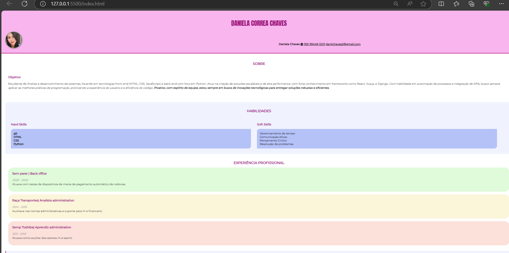

# Atividade de HTML e CSS | # Currículo

# Objetivo

Criar um currículo básico para entendermos as principais **tags e atributos do HTML**, bem como a **semântica do HTML**. Em seguida aplicaremos estilo a esse currículo através do **CSS**, para conhecermos os principais **seletores** e **propriedades/valores**.

